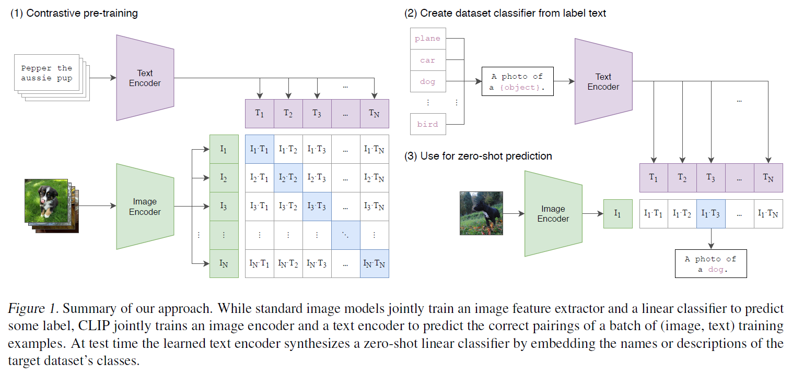

# CLIP

**CLIP: Learning Transferable Visual Models From Natural Language Supervision** [[paper](https://arxiv.org/pdf/2103.00020v1.pdf)] Implementation Code




## Usage

1. Install modules following command.

```
pip install -r requirements.txt
```

2. Prepare Dataset. Download the [[Flickr 8k Dataset]](https://www.kaggle.com/datasets/adityajn105/flickr8k) and place the downloaded data in `./data` directory.

3. Train model.

```
python -m src.train
```


## Reference

- [Paper] [Learning Transferable Visual Models From Natural Language Supervision](https://arxiv.org/pdf/2103.00020v1.pdf)
- [Repo] [moein-shariatnia/OpenAI-CLIP](https://github.com/moein-shariatnia/OpenAI-CLIP)
- [Repo] [openai/CLIP](https://github.com/openai/CLIP)
- [Repo] [Distributed Training in PyTorch](https://github.com/youngerous/distributed-training-comparison)
